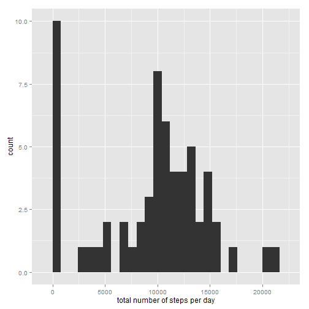
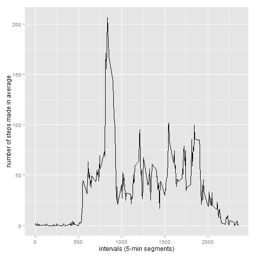
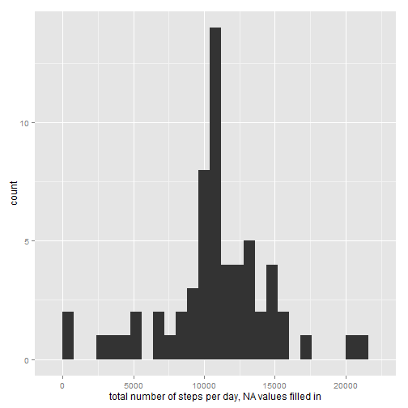
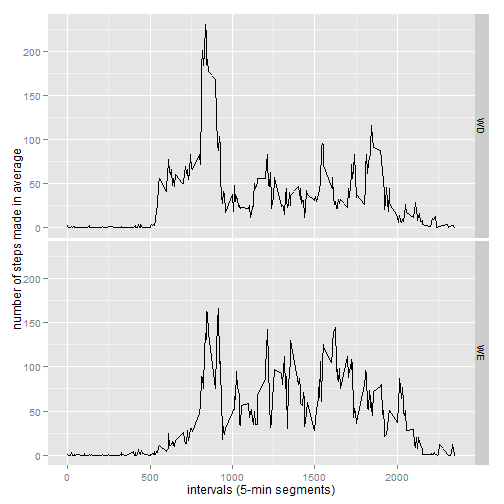

Reproducible Research - Peer Assessment 1
==========================================
title: "PA1_template.Rmd"

author: "Andrii Daniliuk"

---  

## Assignment  

---  

This assignment makes use of data from a personal activity monitoring device. This device collects data at 5 minute intervals through out the day. The data consists of two months of data from an anonymous individual collected during the months of October and November, 2012 and include the number of steps taken in 5 minute intervals each day.

The variables included in this dataset are:

• steps: Number of steps taking in a 5-minute interval (missing values are coded as NA)

• date: The date on which the measurement was taken in YYYY-MM-DD format

• interval: Identifier for the 5-minute interval in which measurement was taken

The dataset is stored in a comma-separated-value (CSV) file and there are a total of 17,568 observations in this dataset.

This assignment is described in multiple parts. The task is to write a report that answers the questions detailed below. Ultimately, it is needed to complete the entire assignment in a single R markdown document that can be processed by knitr and be transformed into an HTML file.

Throughout the report makes sure it always includes the code that used to generate the output presented. So writing code chunks in the R markdown document, the option "echo = TRUE" shall be always used: 


```r
opts_chunk$set(echo=T)
Sys.setlocale("LC_TIME", "English")
```

## Loading and preprocessing the data  

---

First the directory for the data shall be set and the data file needs to be downloaded in it. If the file has been previously downloaded and unzipped the data table with the information required is created:


```r
setwd("C:\\Users\\pc\\Documents\\R Prog\\Reprod Research")
datazip<-"repdata-data-activity.zip"
if(!(file.exists(datazip))) {
        getUrl<-"https://d396qusza40orc.cloudfront.net/repdata%2Fdata%2Factivity.zip"
        download.file(getUrl, destfile = datazip) 
        unzip(datazip)
}
data<-read.csv("activity.csv")
```

Then the data are transformed into a format suitable for the analysis:


```r
steps<-tapply(data$steps,data$date,sum,na.rm=T)
```

## What is mean total number of steps taken per day?  

---

To answer the question the ggplot2 package shall be installed and loaded:


```r
if (!require("ggplot2")) { 
        install.packages("ggplot2") 
} 
```

```
## Loading required package: ggplot2
```

```
## Warning: package 'ggplot2' was built under R version 3.1.2
```

```r
library(ggplot2)
```

Then a histogram of the total number of steps taken each day is created:


```r
qplot(steps,binwidth=800,xlab="total number of steps per day")
```

 

After that the **mean** and **median** total number of steps taken per day are created and reported:


```r
mean(steps,na.rm=T)
```

```
## [1] 9354.23
```


```r
median(steps,na.rm=T)
```

```
## [1] 10395
```

## What is the average daily activity pattern?  

---

To make a time series plot of the 5-minute interval (x-axis) and the average number of steps taken, averaged across all days (y-axis) the avg dataset is selected:


```r
avg<-setNames(aggregate(data$steps~data$interval,data,mean,na.rm=T),c("intervals","steps"))
ggplot(avg,aes(intervals,steps)) + geom_line() + xlab("intervals (5-min segments)") + ylab("number of steps made in average")
```

 

Then the 5-minute interval, on average across all the days in the dataset, contains the maximum number of steps, is found:


```r
avg[which.max(avg$steps),]
```

```
##     intervals    steps
## 104       835 206.1698
```

## Imputing missing values  

---

First the total number of missing values in the dataset is calculated and reported:


```r
missvalues<-is.na(data$steps)
table(missvalues)
```

```
## missvalues
## FALSE  TRUE 
## 15264  2304
```

Then it's needed to replace each missing value with the mean value of its 5-minute interval by looping the NA values (dataNA set). The strategy is to find out the mean value of steps per time interval and substitute the NA values for the calculated mean one:


```r
dataNA<-data
meanint<-tapply(data$steps,data$interval,mean,na.rm=T)
for (i in which(is.na(dataNA)))
    {
    dataNA[i,1]<-meanint[((i-1)%%288)+1]
    }
```

After that the updated plot is printed:


```r
stepsNA<-tapply(dataNA$steps,dataNA$date,sum,na.rm=T)
qplot(stepsNA,binwidth=800,xlab="total number of steps per day, NA values filled in")
```

 

The **mean** and **median** total number of steps taken per day with NA values filled in are created and reported:


```r
mean(stepsNA,na.rm=T)
```

```
## [1] 10766.19
```


```r
median(stepsNA,na.rm=T)
```

```
## [1] 10766.19
```

The mean and median values received differ from the estimates from the first part of the assignment as seen. The inputed missing data are increasing the estimates of the total daily number of steps.

## Are there differences in activity patterns between weekdays and weekends?

---

First a new factor variable in the dataset with two levels – “weekday” and “weekend” indicating whether a given date is a weekday (WD) or weekend (WE) day is created:


```r
weekdate<-function(date) {
    days<-weekdays(date)
    if (days%in%c("Monday","Tuesday","Wednesday","Thursday","Friday")) 
        return("WD") else if (days%in%c("Saturday", "Sunday")) 
        return("WE")
}
dataNA$date<-as.Date(dataNA$date)
dataNA$weekday<-sapply(dataNA$date,FUN=weekdate)
```

Then a panel plot containing a time series plot of the 5-minute interval (x-axis) and the average number of steps taken, averaged across all weekday days or weekend days (y-axis) is created:


```r
avgNA<-setNames(aggregate(dataNA$steps~dataNA$interval+dataNA$weekday,dataNA,mean),c("intervals","weekdays","steps"))
ggplot(avgNA,aes(intervals,steps)) + geom_line() + facet_grid(weekdays~.) + xlab("intervals (5-min segments)") + ylab("number of steps made in average")
```

 
